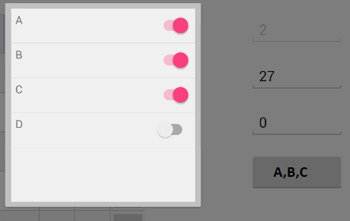

# XFMultiPicker
Listview Popup with multiselect-feature. It still has many restrictions (i.e. custom DataTemplates), which I will hopefully work on in the future.
Currently it is implemted as a button, that opens a popup with a ListView in it.

##Usage
Note that the Model needs a Name (string) property!
Also note that the projects uses the Popup Page Plugin for Xamarin Forms:
https://github.com/rotorgames/Rg.Plugins.Popup/



```xml
<customControls:MultiPicker x:TypeArguments="models:MyType" 
  ItemsSource="{Binding AvailableItems}" 
  SelectedItems="{Binding SelectedItem}"
  Text="{Binding SelectedItem, Converter={StaticResource JoinListConverter}}" />
```
